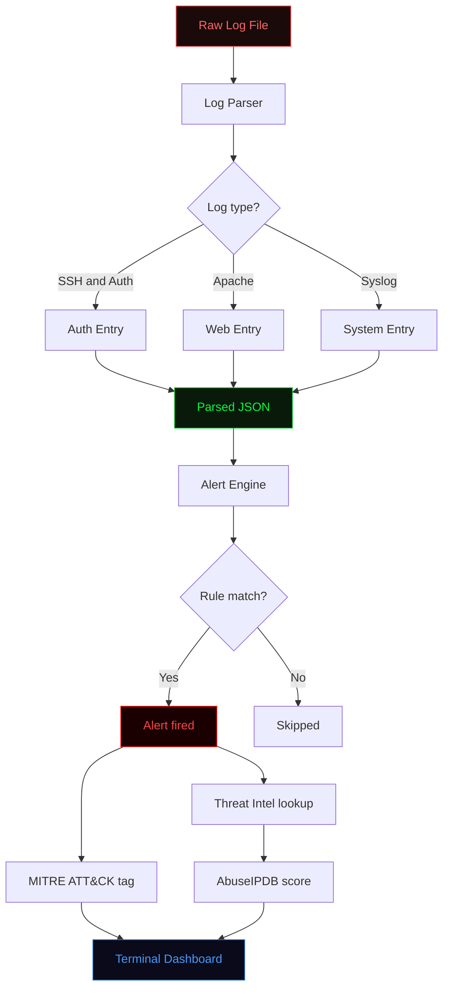
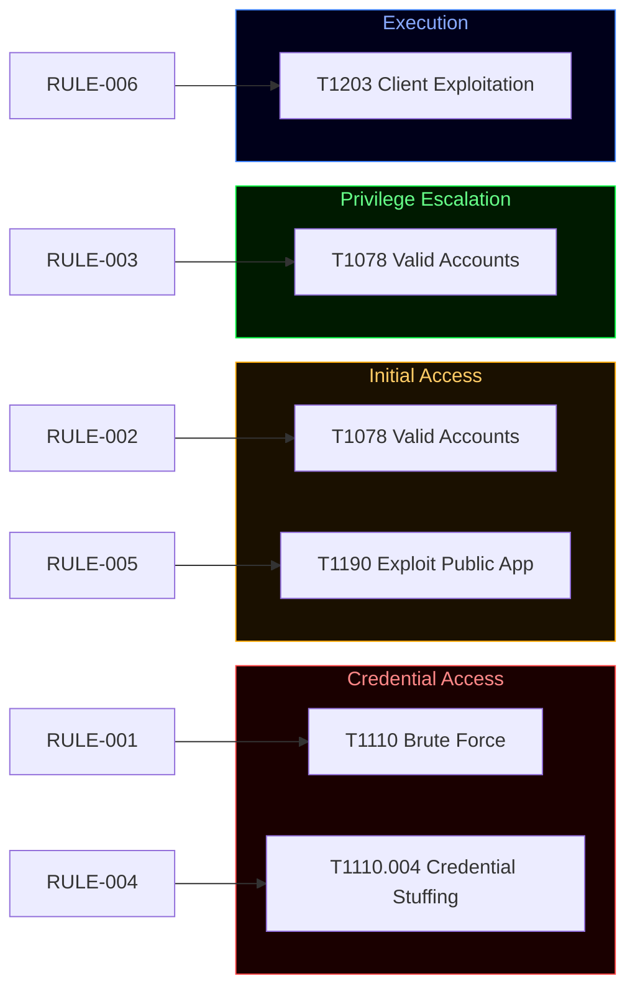
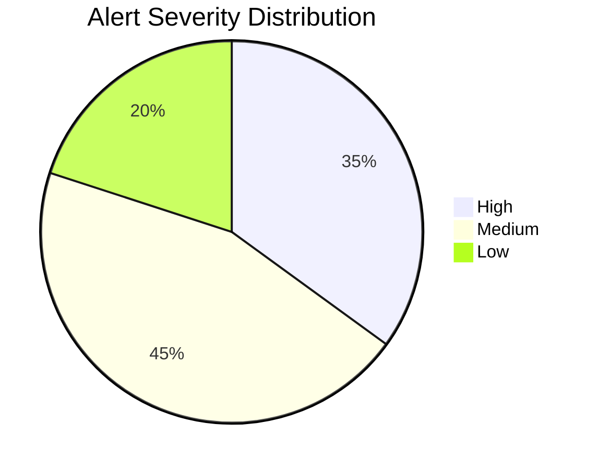
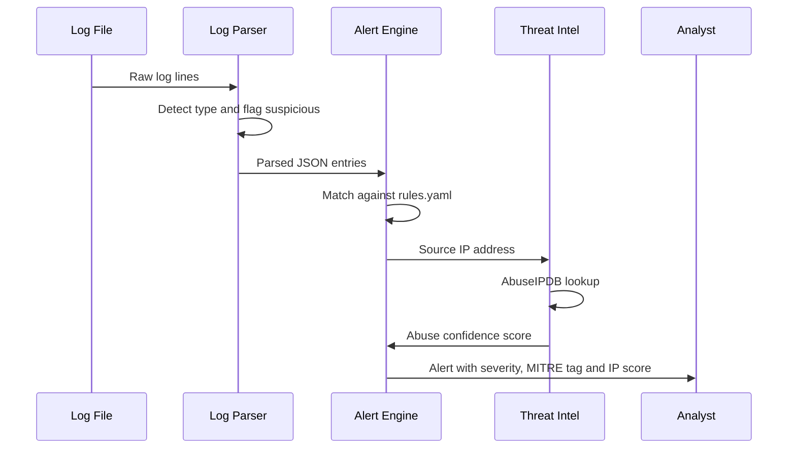

<div align="center">


</div>

<div align="center">


</div>

---

Raw logs go in. Structured alerts with MITRE ATT&CK tags and live threat intelligence scores come out.

Built to understand how a real alert pipeline works from the ground up — not just point a SIEM at logs and hope for the best.

---

## Pipeline overview



---

## Components

| Component | File | What it does |
|---|---|---|
| Log Parser | `soc/log-parser/parser.py` | Reads logs line by line, detects type, flags suspicious entries |
| Alert Engine | `soc/alert-rules/alert_engine.py` | Matches parsed entries against detection rules |
| Detection Rules | `soc/alert-rules/rules.yaml` | YAML rules with MITRE ATT&CK technique mapping |
| Threat Intel | `soc/alert-rules/threat_intel.py` | Checks source IPs against AbuseIPDB in real time |
| Dashboard | `soc/dashboard/dashboard.py` | Terminal overview of log stats and recent alerts |
| IR Playbook | `soc/incident-response/playbook.md` | Step-by-step response per incident type |

---

## MITRE ATT&CK coverage

Each rule is mapped to a technique so every alert tells you not just what happened but how it fits into a real attack pattern.

| Rule | Name | Severity | Technique | Tactic |
|---|---|---|---|---|
| RULE-001 | Brute Force SSH | High | T1110 | Credential Access |
| RULE-002 | Invalid User Login | Medium | T1078 | Initial Access |
| RULE-003 | Sudo Auth Failure | Medium | T1078 | Privilege Escalation |
| RULE-004 | HTTP Credential Stuffing | High | T1110.004 | Credential Access |
| RULE-005 | Admin Path Access | Low | T1190 | Initial Access |
| RULE-006 | Segfault Detected | Medium | T1203 | Execution |



---

## Alert severity distribution



---

## Full detection sequence



---

## Alert output example

```
3 alert(s) triggered:

[HIGH] Brute Force SSH (RULE-001)
  MITRE ATT&CK : T1110 - Brute Force (Credential Access)
  Action       : alert
  Log entry    : Failed password for root from 192.168.1.100 port 22

[HIGH] HTTP Credential Stuffing (RULE-004)
  MITRE ATT&CK : T1110.004 - Credential Stuffing (Credential Access)
  Action       : alert
  Log entry    : POST /login HTTP/1.1

[MEDIUM] Invalid User Login (RULE-002)
  MITRE ATT&CK : T1078 - Valid Accounts (Initial Access)
  Action       : alert
  Log entry    : Invalid user admin from 192.168.1.100
```

---

## Project structure

```
soc-project/
├── soc/
│   ├── log-parser/
│   │   ├── parser.py           <- parses syslog, apache, auth logs
│   │   └── sample.log          <- sample log file for testing
│   ├── alert-rules/
│   │   ├── rules.yaml          <- detection rules with MITRE mapping
│   │   ├── alert_engine.py     <- runs logs against the rules
│   │   └── threat_intel.py     <- AbuseIPDB IP reputation lookup
│   ├── dashboard/
│   │   └── dashboard.py        <- terminal dashboard
│   └── incident-response/
│       └── playbook.md         <- response steps per incident type
├── tests/
│   ├── test_parser.py          <- 6 parser tests
│   └── test_alert_engine.py    <- 5 engine tests
├── .github/workflows/
│   └── tests.yml               <- runs on every push
├── requirements.txt
├── CONTRIBUTING.md
└── CHANGELOG.md
```

---

## Quickstart

```bash
git clone https://github.com/Speed-boo3/soc-project.git
cd soc-project
pip install -r requirements.txt
```

**Step 1 — Parse a log file**
```bash
python soc/log-parser/parser.py --file soc/log-parser/sample.log --output parsed.json
```

**Step 2 — Run detection rules**
```bash
python soc/alert-rules/alert_engine.py --logs parsed.json --rules soc/alert-rules/rules.yaml
```

**Step 3 — Check threat intel**
```bash
export ABUSEIPDB_KEY=your_key_here
python soc/alert-rules/threat_intel.py --logs parsed.json
```

**Step 4 — View dashboard**
```bash
python soc/dashboard/dashboard.py --logs parsed.json
```

---

## Tests

11 tests covering the parser and alert engine. Runs automatically on every push.

```bash
pytest tests/ -v
```

---

## Related

The GRC side of this work is in [grc-project](https://github.com/Speed-boo3/grc-project). SOC detects what is happening. GRC tracks whether the controls that should prevent it are actually in place.

<div align="center">

</div>
