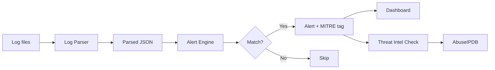
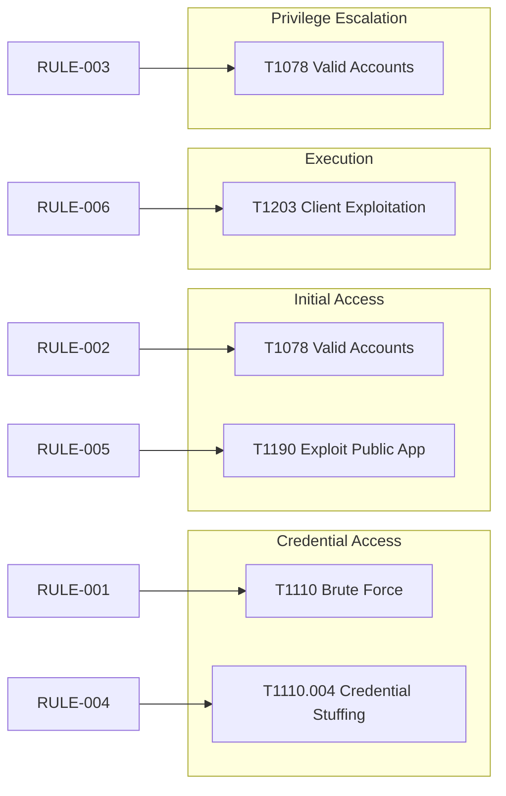
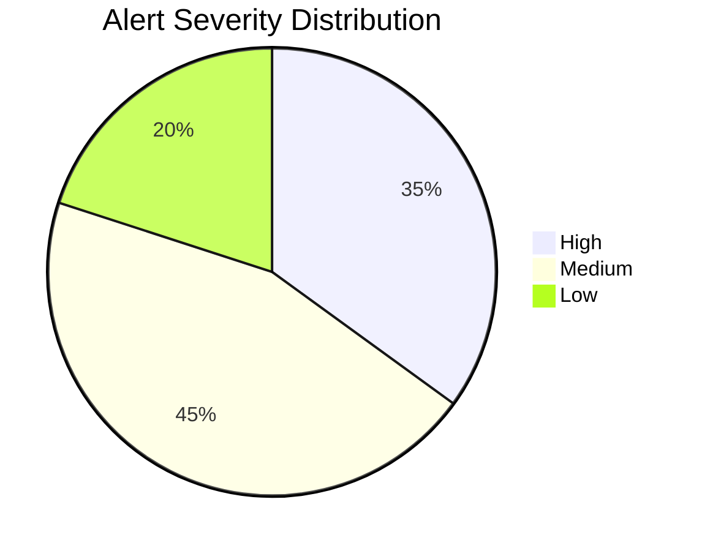
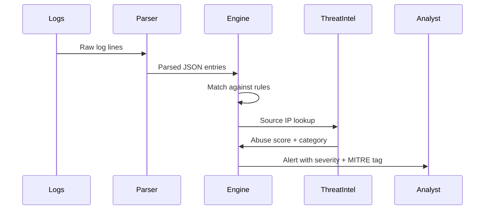

# SOC Project


A Security Operations Center project built as part of a master's in cybersecurity. It covers log parsing, alert detection, threat intelligence lookups and incident response.

---

## What this project does



---

## Project structure

```
soc-project/
├── soc/
│   ├── log-parser/
│   │   ├── parser.py        # Parses syslog, apache and auth logs
│   │   └── sample.log       # Sample log file for testing
│   ├── alert-rules/
│   │   ├── rules.yaml       # Detection rules with MITRE ATT&CK mapping
│   │   ├── alert_engine.py  # Runs logs against the rules
│   │   └── threat_intel.py  # Checks IPs against AbuseIPDB
│   ├── dashboard/
│   │   └── dashboard.py     # Terminal dashboard
│   └── incident-response/
│       └── playbook.md      # IR playbook per incident type
├── tests/
│   ├── test_parser.py
│   └── test_alert_engine.py
├── requirements.txt
├── CONTRIBUTING.md
└── CHANGELOG.md
```

---

## How it works

### 1. Parse logs

```bash
python soc/log-parser/parser.py --file soc/log-parser/sample.log --output parsed.json
```

The parser reads the log file line by line and figures out what type each line is — SSH auth, Apache access log, or general syslog. It flags anything suspicious.

### 2. Run alerts

```bash
python soc/alert-rules/alert_engine.py --logs parsed.json --rules soc/alert-rules/rules.yaml
```

The alert engine checks each parsed log entry against the rules in `rules.yaml`. When a rule matches it prints an alert with the severity level and MITRE ATT&CK technique ID.

### 3. Check threat intel

```bash
python soc/alert-rules/threat_intel.py --logs parsed.json
```

This pulls unique IPs from the parsed logs and checks each one against AbuseIPDB. It shows a confidence score and abuse category for any known bad IPs.

> You need a free AbuseIPDB API key. Get one at https://www.abuseipdb.com/register and set it as an environment variable: `export ABUSEIPDB_KEY=your_key_here`

### 4. View dashboard

```bash
python soc/dashboard/dashboard.py --logs parsed.json
```

---

## Alert example

```
[HIGH] Brute Force SSH (RULE-001)
  MITRE ATT&CK : T1110 – Brute Force
  Action       : alert
  Log entry    : Failed password for root from 192.168.1.100 port 22

[MEDIUM] Invalid User Login (RULE-002)
  MITRE ATT&CK : T1078 – Valid Accounts
  Action       : alert
  Log entry    : Invalid user admin from 192.168.1.100
```

---

## MITRE ATT&CK coverage

| Tactic | Technique ID | Technique Name | Rule |
|---|---|---|---|
| Credential Access | T1110 | Brute Force | RULE-001 |
| Credential Access | T1110.004 | Credential Stuffing | RULE-004 |
| Initial Access | T1078 | Valid Accounts | RULE-002 |
| Privilege Escalation | T1078 | Valid Accounts | RULE-003 |
| Initial Access | T1190 | Exploit Public-Facing Application | RULE-005 |
| Execution | T1203 | Exploitation for Client Execution | RULE-006 |



---

## Alert severity breakdown (sample run)



---

## How the detection pipeline runs



---

## Setup

```bash
git clone https://github.com/Speed-boo3/soc-project.git
cd soc-project
pip install -r requirements.txt
export ABUSEIPDB_KEY=your_key_here
```

---

## Running the tests

```bash
pytest tests/
```

---

## Related project

The GRC side of this work lives in a separate repo: [grc-project](https://github.com/Speed-boo3/grc-project)

SOC detects threats. GRC makes sure the controls are in place to prevent them. The two feed each other.
