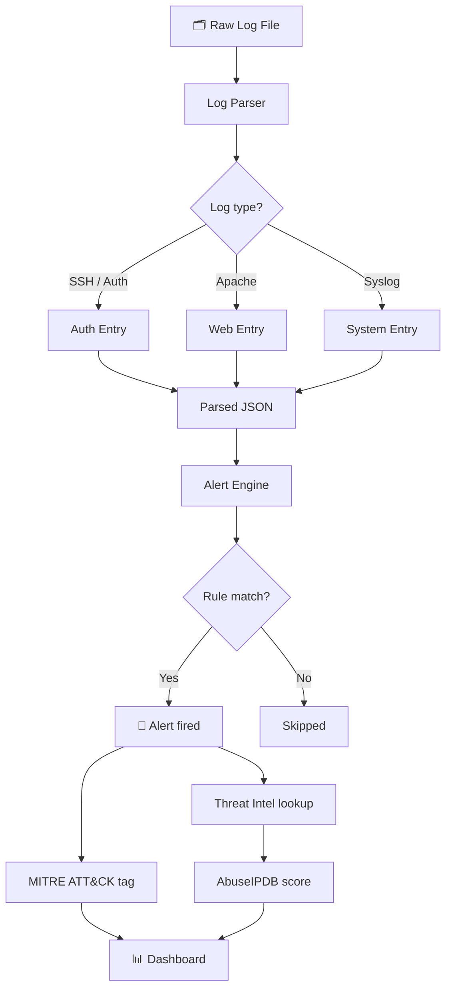
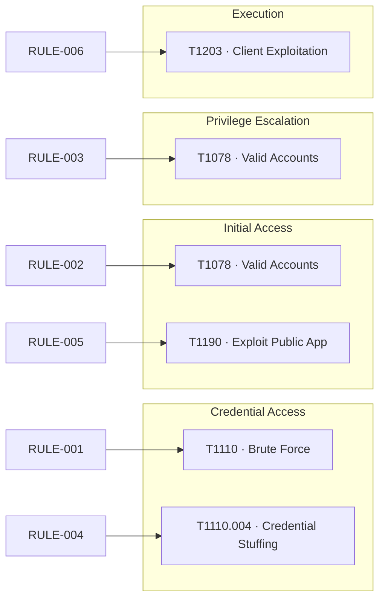
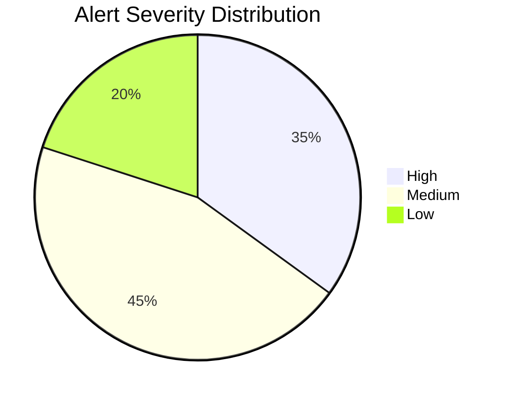
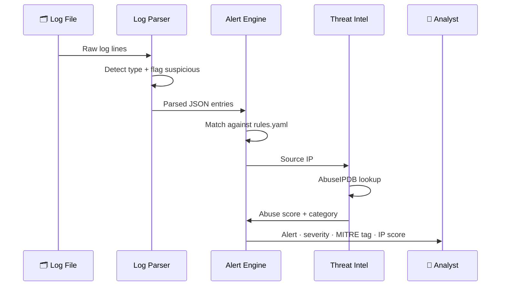

# SOC Project


A log analysis and alert detection pipeline built in Python. Raw logs go in — structured alerts with MITRE ATT&CK tags and threat intelligence scores come out.

---

## How it works

Raw log files are parsed, normalised and run through a detection rule engine. Every alert that fires gets a MITRE ATT&CK technique ID attached and the source IP is checked against AbuseIPDB in real time.



---

## Components

| Component | File | What it does |
|---|---|---|
| Log Parser | `soc/log-parser/parser.py` | Reads log files, detects type, flags suspicious lines |
| Alert Engine | `soc/alert-rules/alert_engine.py` | Matches parsed logs against detection rules |
| Detection Rules | `soc/alert-rules/rules.yaml` | YAML rules with MITRE ATT&CK mapping |
| Threat Intel | `soc/alert-rules/threat_intel.py` | Checks IPs against AbuseIPDB |
| Dashboard | `soc/dashboard/dashboard.py` | Terminal overview of log and alert data |
| IR Playbook | `soc/incident-response/playbook.md` | Step-by-step response per incident type |

---

## Detection rules and MITRE ATT&CK coverage

Each rule maps directly to a MITRE ATT&CK technique so every alert tells you not just *what* happened but *how it fits into an attack pattern*.

| Rule | Name | Severity | MITRE ID | Tactic |
|---|---|---|---|---|
| RULE-001 | Brute Force SSH | 🔴 High | T1110 | Credential Access |
| RULE-002 | Invalid User Login | 🟡 Medium | T1078 | Initial Access |
| RULE-003 | Sudo Auth Failure | 🟡 Medium | T1078 | Privilege Escalation |
| RULE-004 | HTTP Credential Stuffing | 🔴 High | T1110.004 | Credential Access |
| RULE-005 | Admin Path Access | 🟢 Low | T1190 | Initial Access |
| RULE-006 | Segfault Detected | 🟡 Medium | T1203 | Execution |



---

## Alert output example

```
3 alert(s) triggered:

[HIGH] Brute Force SSH (RULE-001)
  MITRE ATT&CK : T1110 – Brute Force (Credential Access)
  Action       : alert
  Log entry    : Failed password for root from 192.168.1.100 port 22

[HIGH] HTTP Credential Stuffing (RULE-004)
  MITRE ATT&CK : T1110.004 – Credential Stuffing (Credential Access)
  Action       : alert
  Log entry    : POST /login HTTP/1.1

[MEDIUM] Invalid User Login (RULE-002)
  MITRE ATT&CK : T1078 – Valid Accounts (Initial Access)
  Action       : alert
  Log entry    : Invalid user admin from 192.168.1.100
```

---

## Alert severity distribution



---

## Detection pipeline — full sequence



---

## Project structure

```
soc-project/
├── soc/
│   ├── log-parser/
│   │   ├── parser.py           ← parses syslog, apache, auth logs
│   │   └── sample.log          ← sample log file for testing
│   ├── alert-rules/
│   │   ├── rules.yaml          ← detection rules with MITRE mapping
│   │   ├── alert_engine.py     ← runs logs against the rules
│   │   └── threat_intel.py     ← AbuseIPDB IP reputation lookup
│   ├── dashboard/
│   │   └── dashboard.py        ← terminal dashboard
│   └── incident-response/
│       └── playbook.md         ← response steps per incident type
├── tests/
│   ├── test_parser.py          ← 6 parser tests
│   └── test_alert_engine.py    ← 5 engine tests
├── .github/workflows/
│   └── tests.yml               ← runs on every push
├── requirements.txt
├── CONTRIBUTING.md
└── CHANGELOG.md
```

---

## Quickstart

```bash
git clone https://github.com/Speed-boo3/soc-project.git
cd soc-project
pip install -r requirements.txt
```

**Step 1 — Parse a log file**
```bash
python soc/log-parser/parser.py --file soc/log-parser/sample.log --output parsed.json
```

**Step 2 — Run detection rules**
```bash
python soc/alert-rules/alert_engine.py --logs parsed.json --rules soc/alert-rules/rules.yaml
```

**Step 3 — Check threat intel** *(requires free AbuseIPDB key)*
```bash
export ABUSEIPDB_KEY=your_key_here
python soc/alert-rules/threat_intel.py --logs parsed.json
```

**Step 4 — View dashboard**
```bash
python soc/dashboard/dashboard.py --logs parsed.json
```

---

## Tests

11 tests covering the parser and alert engine. Runs automatically on every push via GitHub Actions.

```bash
pytest tests/ -v
```

---

## Related

The GRC side of this work is in [grc-project](https://github.com/Speed-boo3/grc-project) — risk scoring, compliance checking and network scanning. SOC detects what's happening. GRC tracks whether the controls that should prevent it are actually in place.
