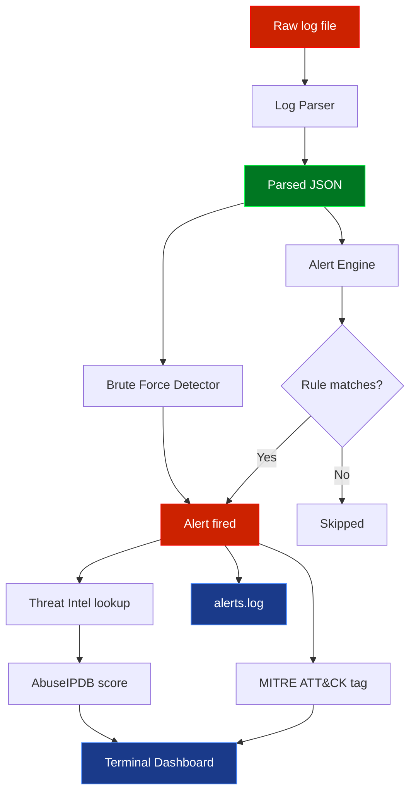
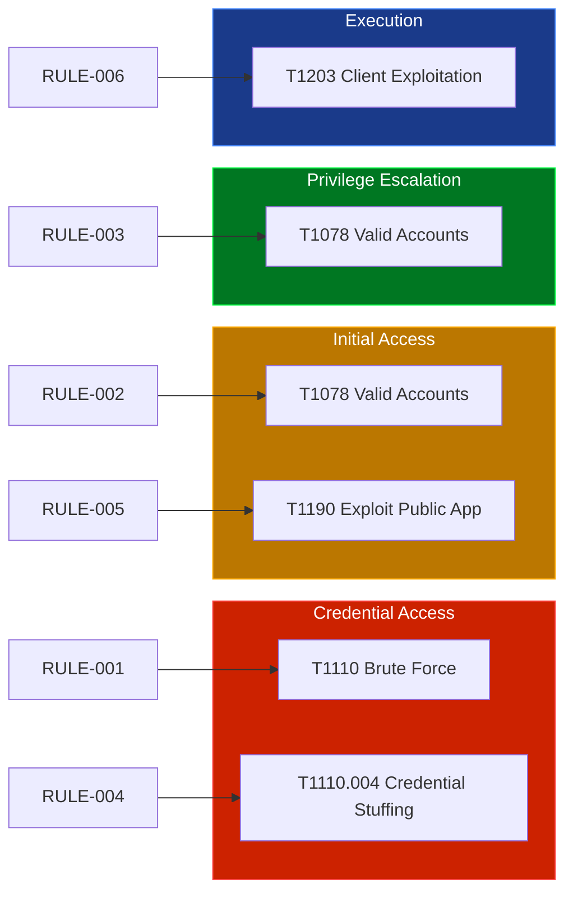
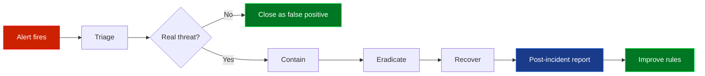

<div align="center">


<br/>


</div>

---

## Interactive learning site

<div align="center">

[](https://speed-boo3.github.io/soc-project/explain/)

</div>

Six modules covering everything from what a SOC is to MITRE ATT&CK, live threat intel lookups and an analyst skills checklist. With matrix rain animation and a live alert ticker.

---

## What is this

A Security Operations Center project built from scratch in Python. It is designed for students who want to understand how SOC work actually looks in practice — not just theory.

Every tool here solves a real problem. The log parser, the alert engine, the threat intelligence lookup, the brute force detector — these are simplified versions of what real analysts use every day. You can run them, read the code and understand exactly what is happening at each step.

---

## What is a SOC

A Security Operations Center is a team that monitors an organisation's systems around the clock, looking for signs of attack. When something suspicious shows up in the logs, the SOC investigates it, decides if it is a real threat, and responds accordingly.

The core job of a SOC analyst breaks down into four things:

**Collect** — gather logs from servers, firewalls, endpoints and applications into one place

**Detect** — run those logs through detection rules that flag suspicious patterns

**Investigate** — figure out whether an alert is a real attack or a false positive

**Respond** — if it is real, contain it, remove it and recover from it

This project covers all four.

---

## How the tools connect



---

## Tools

### Log Parser `soc/log-parser/parser.py`

Reads a log file line by line, figures out what type each line is — SSH auth, Apache access log or syslog — and flags anything suspicious. Outputs a structured JSON file that the rest of the tools can use.

```bash
python soc/log-parser/parser.py --file soc/log-parser/sample.log --output parsed.json
```

Output:
```
Total log entries : 19
Suspicious events : 11

--- Suspicious entries ---
  [syslog] Failed password for root from 45.33.32.156 port 55018 ssh2
  [syslog] Invalid user ftpuser from 45.33.32.156
  [syslog] pam_unix(sudo:auth): authentication failure
```

### Alert Engine `soc/alert-rules/alert_engine.py`

Matches parsed log entries against detection rules written in YAML. Every rule maps to a MITRE ATT&CK technique, so every alert tells you not just what happened but what kind of attack it fits.

```bash
python soc/alert-rules/alert_engine.py \
  --logs parsed.json \
  --rules soc/alert-rules/rules.yaml \
  --output alerts.log
```

Output:
```
3 alert(s) triggered:

[HIGH] Brute Force Detected (RULE-BF)
  MITRE ATT&CK : T1110 - Brute Force (Credential Access)
  Action       : alert
  Log entry    : Source IP 45.33.32.156 had 9 failed login attempts

[MEDIUM] Sudo Authentication Failure (RULE-003)
  MITRE ATT&CK : T1078 - Valid Accounts (Privilege Escalation)
  Action       : log
  Log entry    : pam_unix(sudo:auth): authentication failure

[MEDIUM] Segfault Detected (RULE-006)
  MITRE ATT&CK : T1203 - Exploitation for Client Execution (Execution)
  Action       : alert
  Log entry    : program[9708]: segfault at 0 ip 00007f
```

### Brute Force Detector `soc/brute-force-detector/detector.py`

Reads auth logs and flags IPs with too many failed login attempts within a configurable time window. Uses an actual sliding window — not just a total count — so it catches attacks that happen quickly even if there are long gaps between them.

```bash
python soc/brute-force-detector/detector.py \
  --file soc/log-parser/sample.log \
  --threshold 5 \
  --window 300
```

Output:
```
Brute Force Detection Report
============================================================
Threshold : 5 attempts within 300 seconds

FLAGGED IPs:
  45.33.32.156        9 in window / 9 total   BLOCK RECOMMENDED
```

### Threat Intel `soc/alert-rules/threat_intel.py`

Pulls all unique IPs from a parsed log file and checks each one against AbuseIPDB. Returns an abuse confidence score, total number of reports and the categories of abuse.

```bash
export ABUSEIPDB_KEY=your_key_here
python soc/alert-rules/threat_intel.py --logs parsed.json
```

Get a free key at [abuseipdb.com/register](https://www.abuseipdb.com/register).

### Dashboard `soc/dashboard/dashboard.py`

Terminal overview of everything in one place — log volume by type, top source IPs, HTTP status codes and the most recent suspicious events.

```bash
python soc/dashboard/dashboard.py --logs parsed.json
```

### IR Playbook `soc/incident-response/playbook.md`

Step-by-step response procedures for each alert type, based on NIST SP 800-61. Covers what to do when each rule fires, how to escalate, and what the post-incident report should include.

### Hash Checker `soc/hash-checker/hash_checker.py`

Identifies hash algorithm type and checks a hash against a local database of known malware hashes. Useful during incident response when you need to quickly assess a suspicious file.

```bash
python soc/hash-checker/hash_checker.py --hash d41d8cd98f00b204e9800998ecf8427e
```

### Log Generator `soc/log-parser/generate_logs.py`

Generates realistic log files with random IPs, usernames, ports and attack patterns for testing. The daily GitHub Actions workflow uses this to create a fresh log file every morning and run the full pipeline against it.

```bash
python soc/log-parser/generate_logs.py
```

---

## MITRE ATT&CK coverage

Every detection rule is mapped to a technique. When an alert fires you immediately know what category of attack you are looking at.



---

## Incident response

When an alert fires, the response follows the NIST SP 800-61 lifecycle.



The full playbook with step-by-step procedures for each scenario is in `soc/incident-response/playbook.md`.

---

## Daily automated scan

GitHub Actions runs every morning at 07:00 UTC. It generates a fresh log file, runs the full pipeline and commits the results. This keeps the project active and builds up `alerts.log` over time as a running record of detections.

The workflow file is in `.github/workflows/daily-scan.yml`.

---

## Project structure

```
soc-project/
├── soc/
│   ├── log-parser/
│   │   ├── parser.py                ← reads and classifies log lines
│   │   ├── generate_logs.py         ← generates realistic test logs
│   │   └── sample.log               ← latest generated log file
│   ├── alert-rules/
│   │   ├── rules.yaml               ← detection rules with MITRE mapping
│   │   ├── alert_engine.py          ← runs logs against the rules
│   │   └── threat_intel.py          ← AbuseIPDB IP reputation lookup
│   ├── dashboard/
│   │   └── dashboard.py             ← terminal overview
│   ├── incident-response/
│   │   └── playbook.md              ← IR playbook per incident type
│   ├── hash-checker/
│   │   └── hash_checker.py          ← hash type detection and malware check
│   └── brute-force-detector/
│       └── detector.py              ← sliding window brute force detection
├── tests/
│   ├── test_parser.py
│   └── test_alert_engine.py
├── .github/workflows/
│   ├── tests.yml                    ← runs on every push
│   └── daily-scan.yml               ← runs every morning at 07:00 UTC
├── alerts.log                       ← cumulative alert history
├── requirements.txt
├── CONTRIBUTING.md
└── CHANGELOG.md
```

---

## Quickstart

```bash
git clone https://github.com/Speed-boo3/soc-project.git
cd soc-project
pip install -r requirements.txt
```

Run the full pipeline:

```bash
python soc/log-parser/generate_logs.py
python soc/log-parser/parser.py --file soc/log-parser/sample.log --output parsed.json
python soc/alert-rules/alert_engine.py --logs parsed.json --rules soc/alert-rules/rules.yaml
python soc/dashboard/dashboard.py --logs parsed.json
```

Run the tests:

```bash
pytest tests/ -v
```

---

## Test your knowledge

20 questions covering SOC fundamentals — what is a SOC, log analysis, MITRE ATT&CK, threat intelligence, incident response, detection engineering, network security and forensics.

<div align="center">

[](https://speed-boo3.github.io/soc-project/quiz/)

</div>

---

## Learn more

- [MITRE ATT&CK](https://attack.mitre.org) — the full technique and tactic library
- [NIST SP 800-61](https://csrc.nist.gov/publications/detail/sp/800-61/rev-2/final) — incident handling guide
- [AbuseIPDB](https://www.abuseipdb.com) — IP reputation database
- [Sigma HQ](https://github.com/SigmaHQ/sigma) — community detection rules
- [LetsDefend](https://letsdefend.io) — SOC analyst training platform
- [Blue Team Notes](https://github.com/Purp1eW0lf/Blue-Team-Notes) — practical blue team reference

---

The GRC side of this project is in [grc-project](https://github.com/Speed-boo3/grc-project). SOC detects what is happening. GRC tracks whether the controls that should prevent it are actually in place.

<div align="center">

</div>
