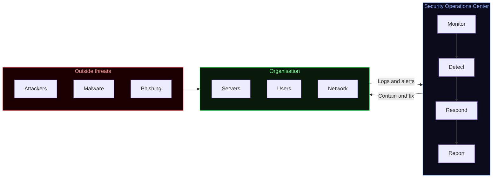
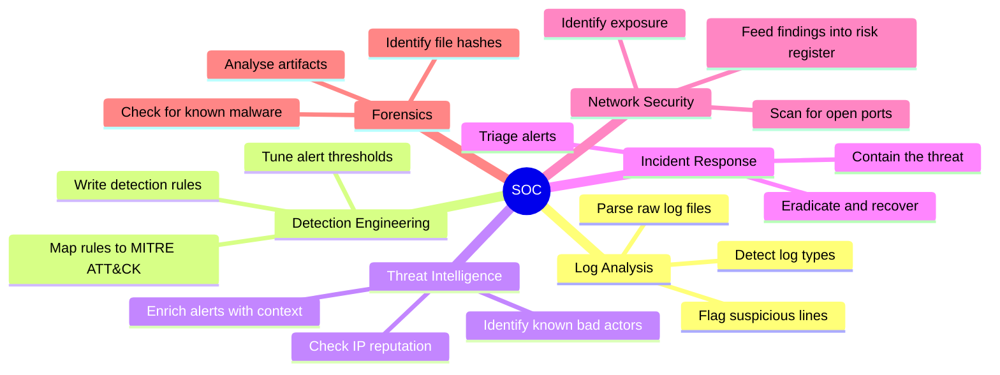
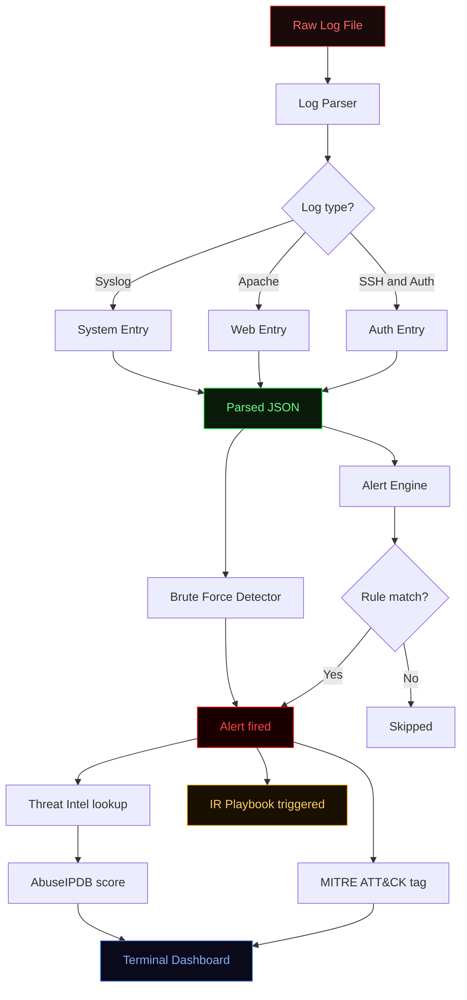
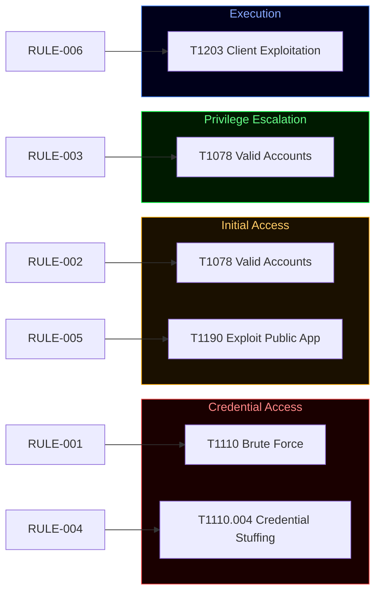
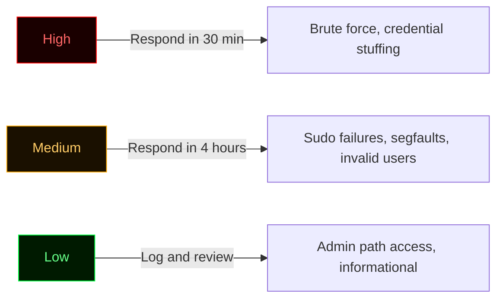
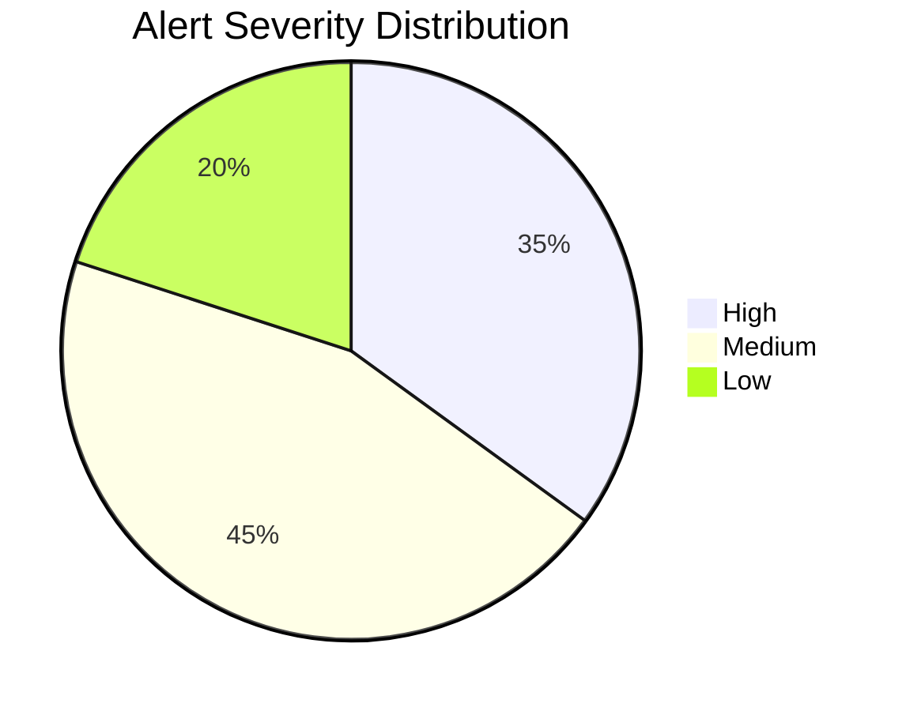
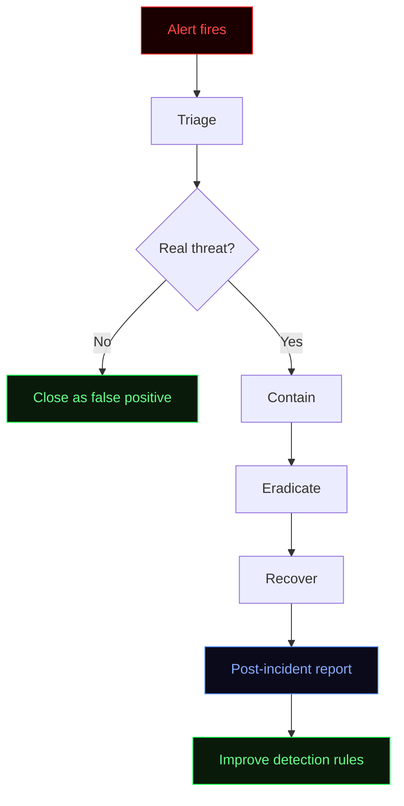
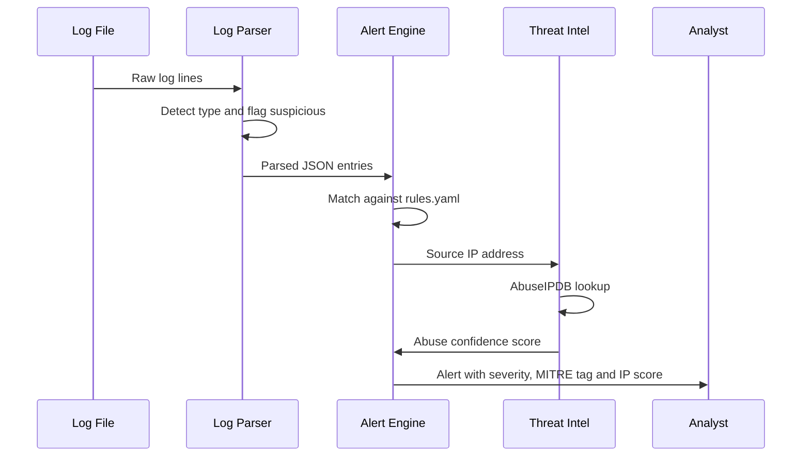

<div align="center">


<br/>


</div>

---

## What is this project?

This is a hands-on SOC project built from scratch in Python. It is designed for students and anyone curious about how security operations actually work — not just in theory, but in practice.

Every tool in this project solves a real problem that a SOC analyst faces daily. You can run it yourself, break it, modify it and learn from it.

---

## What is a SOC?

A **Security Operations Center** is a team of security analysts who monitor, detect and respond to threats against an organisation 24/7. Think of it as the defensive nerve center of a company's security.



A SOC analyst's job is to:
- Collect logs from servers, firewalls, endpoints and applications
- Detect suspicious patterns using rules and threat intelligence
- Investigate alerts to determine if they are real threats or false positives
- Respond to confirmed incidents following structured playbooks
- Document findings and improve detection over time

---

## SOC categories — what a SOC covers

A real SOC is split into several focus areas. This project covers all of them:



---

## The detection pipeline

This is how raw logs become actionable alerts:



---

## Tools

| Tool | File | Category | What it does |
|---|---|---|---|
| Log Parser | `soc/log-parser/parser.py` | Log Analysis | Reads log files, detects type, flags suspicious entries |
| Alert Engine | `soc/alert-rules/alert_engine.py` | Detection Engineering | Runs parsed logs through MITRE ATT&CK-mapped rules |
| Detection Rules | `soc/alert-rules/rules.yaml` | Detection Engineering | YAML rules — one per threat scenario |
| Threat Intel | `soc/alert-rules/threat_intel.py` | Threat Intelligence | Checks source IPs against AbuseIPDB in real time |
| Dashboard | `soc/dashboard/dashboard.py` | Monitoring | Terminal overview of log stats and live alerts |
| IR Playbook | `soc/incident-response/playbook.md` | Incident Response | Step-by-step response per MITRE technique |
| Hash Checker | `soc/hash-checker/hash_checker.py` | Forensics | Identifies hash type and checks against malware database |
| Brute Force Detector | `soc/brute-force-detector/detector.py` | Detection | Flags IPs with too many failed login attempts |

---

## MITRE ATT&CK

MITRE ATT&CK is a globally recognised framework that maps attacker behaviour to specific techniques. Every detection rule in this project is tagged with a technique ID so you always know what attack you are looking at.

> For example: when a rule fires for repeated failed SSH logins, it is tagged as **T1110 — Brute Force** under the **Credential Access** tactic. This tells you immediately what the attacker is trying to do.

| Rule | Name | Severity | Technique | Tactic |
|---|---|---|---|---|
| RULE-001 | Brute Force SSH | High | T1110 | Credential Access |
| RULE-002 | Invalid User Login | Medium | T1078 | Initial Access |
| RULE-003 | Sudo Auth Failure | Medium | T1078 | Privilege Escalation |
| RULE-004 | HTTP Credential Stuffing | High | T1110.004 | Credential Access |
| RULE-005 | Admin Path Access | Low | T1190 | Initial Access |
| RULE-006 | Segfault Detected | Medium | T1203 | Execution |



---

## Alert severity levels

Not every alert is equally urgent. This project uses three severity levels:





---

## Incident response

When an alert fires, the SOC follows a structured response process. This is based on NIST SP 800-61 — the industry standard for incident response.



Full playbooks for each scenario are in `soc/incident-response/playbook.md`.

---

## What alerts look like

This is what the alert engine outputs when it detects something:

```
3 alert(s) triggered:

[HIGH] Brute Force SSH (RULE-001)
  MITRE ATT&CK : T1110 - Brute Force (Credential Access)
  Action       : alert
  Log entry    : Failed password for root from 192.168.1.100 port 22

[HIGH] HTTP Credential Stuffing (RULE-004)
  MITRE ATT&CK : T1110.004 - Credential Stuffing (Credential Access)
  Action       : alert
  Log entry    : POST /login HTTP/1.1

[MEDIUM] Invalid User Login (RULE-002)
  MITRE ATT&CK : T1078 - Valid Accounts (Initial Access)
  Action       : alert
  Log entry    : Invalid user admin from 192.168.1.100
```

---

## Full detection sequence

This diagram shows every step from raw log to analyst — including the threat intelligence lookup:



---

## Project structure

```
soc-project/
├── soc/
│   ├── log-parser/
│   │   ├── parser.py               <- reads and classifies log lines
│   │   └── sample.log              <- sample log for testing
│   ├── alert-rules/
│   │   ├── rules.yaml              <- detection rules with MITRE mapping
│   │   ├── alert_engine.py         <- runs logs against the rules
│   │   └── threat_intel.py         <- AbuseIPDB IP reputation lookup
│   ├── dashboard/
│   │   └── dashboard.py            <- terminal dashboard
│   ├── incident-response/
│   │   └── playbook.md             <- IR playbook per incident type
│   ├── hash-checker/
│   │   └── hash_checker.py         <- identifies hash type, checks malware db
│   └── brute-force-detector/
│       └── detector.py             <- flags IPs with too many failed logins
├── tests/
│   ├── test_parser.py              <- 6 parser tests
│   └── test_alert_engine.py        <- 5 engine tests
├── .github/workflows/
│   └── tests.yml                   <- runs on every push
├── requirements.txt
├── CONTRIBUTING.md
└── CHANGELOG.md
```

---

## Quickstart

```bash
git clone https://github.com/Speed-boo3/soc-project.git
cd soc-project
pip install -r requirements.txt
```

**Step 1 — Parse a log file**
```bash
python soc/log-parser/parser.py --file soc/log-parser/sample.log --output parsed.json
```

**Step 2 — Run detection rules**
```bash
python soc/alert-rules/alert_engine.py --logs parsed.json --rules soc/alert-rules/rules.yaml
```

**Step 3 — Check threat intel**
```bash
export ABUSEIPDB_KEY=your_key_here
python soc/alert-rules/threat_intel.py --logs parsed.json
```

**Step 4 — View dashboard**
```bash
python soc/dashboard/dashboard.py --logs parsed.json
```

**Step 5 — Check a file hash**
```bash
python soc/hash-checker/hash_checker.py --hash d41d8cd98f00b204e9800998ecf8427e
```

**Step 6 — Detect brute force attempts**
```bash
python soc/brute-force-detector/detector.py --file soc/log-parser/sample.log --threshold 3
```

---

## Tests

```bash
pytest tests/ -v
```

11 tests covering the log parser and alert engine. Runs automatically on every push via GitHub Actions.

---

## Want to learn more about SOC?

If this project got you interested in blue team security, here are some good starting points:

- [MITRE ATT&CK Framework](https://attack.mitre.org) — the full technique library
- [NIST SP 800-61](https://csrc.nist.gov/publications/detail/sp/800-61/rev-2/final) — incident response guide
- [AbuseIPDB](https://www.abuseipdb.com) — free threat intelligence API
- [OWASP WSTG](https://owasp.org/www-project-web-security-testing-guide/) — web security testing guide

---

## Related

The GRC side of this work is in [grc-project](https://github.com/Speed-boo3/grc-project). SOC detects what is happening. GRC tracks whether the controls that should prevent it are actually in place.

<div align="center">

</div>
