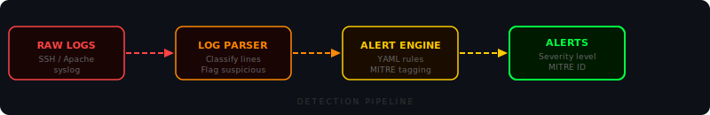
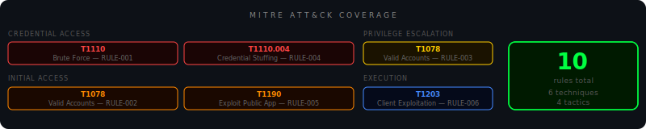
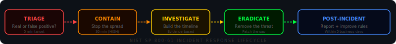

<div align="center">


<br/>


<br/>

[](https://speed-boo3.github.io/soc-project/explain/)

</div>

---

## What this project is

A Security Operations Center built from scratch in Python. Every tool solves a real problem — the same problems real SOC analysts deal with every day. Raw logs go in. Structured, MITRE-tagged alerts come out.

---

## How it works



---

## What it looks like in practice


---

<div align="center">

</div>

---

## The tools

**Log parser** reads raw log files line by line. Detects whether each line is SSH auth, Apache access or syslog. Flags anything suspicious. Outputs structured JSON.

```bash
python soc/log-parser/parser.py --file soc/log-parser/sample.log --output parsed.json
```

```
Total log entries : 22
Suspicious events : 14

--- Suspicious entries ---
  [syslog] Failed password for root from 45.33.32.156 port 55018 ssh2
  [syslog] Invalid user ftpuser from 45.33.32.156
  [syslog] pam_unix(sudo:auth): authentication failure uid=1003
  [apache] GET /../etc/passwd HTTP/1.1 400 — directory traversal attempt
  [apache] GET /search?q=1' OR '1'='1 — SQL injection probe
```

**Alert engine** runs YAML detection rules against the parsed output. Every rule maps to a MITRE ATT&CK technique so every alert tells you what the attacker is trying to accomplish.

```bash
python soc/alert-rules/alert_engine.py --logs parsed.json --rules soc/alert-rules/rules.yaml
```

```
[HIGH] Brute Force Detected (RULE-001)
  MITRE ATT&CK : T1110 - Brute Force (Credential Access)
  Log entry    : Source IP 45.33.32.156 had 9 failed logins in 120s

[MEDIUM] Sudo Authentication Failure (RULE-003)
  MITRE ATT&CK : T1078 - Valid Accounts (Privilege Escalation)
  Log entry    : pam_unix(sudo:auth): authentication failure uid=1003
```

**Brute force detector** uses a sliding time window. Nine attempts in 30 seconds is treated very differently to nine attempts over three days — because attack rate matters more than total count.

```bash
python soc/brute-force-detector/detector.py --file soc/log-parser/sample.log --threshold 5 --window 300
```

```
Brute Force Detection Report
Threshold : 5 attempts within 300 seconds

FLAGGED IPs:
  45.33.32.156    9 in window / 9 total   BLOCK RECOMMENDED
```

**Threat intelligence** checks every source IP against AbuseIPDB. A 97% abuse confidence score changes a suspicious login into a confirmed targeted attack from a known threat actor.

```bash
export ABUSEIPDB_KEY=your_key_here
python soc/alert-rules/threat_intel.py --logs parsed.json
```

---

## MITRE ATT&CK coverage



---

## Incident response lifecycle



The full playbook with step-by-step procedures for each scenario is in `soc/incident-response/playbook.md`.

---

<div align="center">

</div>

---

## Project structure

```
soc-project/
├── soc/
│   ├── log-parser/
│   │   ├── parser.py               <- reads and classifies every log line
│   │   ├── generate_logs.py        <- generates realistic test logs daily
│   │   └── sample.log              <- latest generated log file
│   ├── alert-rules/
│   │   ├── rules.yaml              <- 10 detection rules with MITRE mapping
│   │   ├── alert_engine.py         <- runs logs against the rules
│   │   └── threat_intel.py         <- AbuseIPDB IP reputation lookup
│   ├── brute-force-detector/
│   │   └── detector.py             <- sliding window brute force detection
│   ├── dashboard/
│   │   └── dashboard.py            <- terminal overview
│   └── incident-response/
│       └── playbook.md             <- NIST SP 800-61 IR procedures
├── tests/
├── .github/workflows/
│   ├── tests.yml                   <- runs on every push
│   └── daily-scan.yml              <- 07:00 UTC every morning
└── alerts.log                      <- cumulative alert history
```

---

## Quickstart

```bash
git clone https://github.com/Speed-boo3/soc-project.git
cd soc-project
pip install -r requirements.txt
```

```bash
python soc/log-parser/generate_logs.py
python soc/log-parser/parser.py --file soc/log-parser/sample.log --output parsed.json
python soc/alert-rules/alert_engine.py --logs parsed.json --rules soc/alert-rules/rules.yaml
```

```bash
pytest tests/ -v
```

---

## Learn more

- [MITRE ATT&CK](https://attack.mitre.org) — technique and tactic library
- [NIST SP 800-61](https://csrc.nist.gov/publications/detail/sp/800-61/rev-2/final) — incident handling guide
- [AbuseIPDB](https://www.abuseipdb.com) — IP reputation database
- [Sigma HQ](https://github.com/SigmaHQ/sigma) — community detection rules
- [LetsDefend](https://letsdefend.io) — SOC analyst training platform

<div align="center">

</div>
